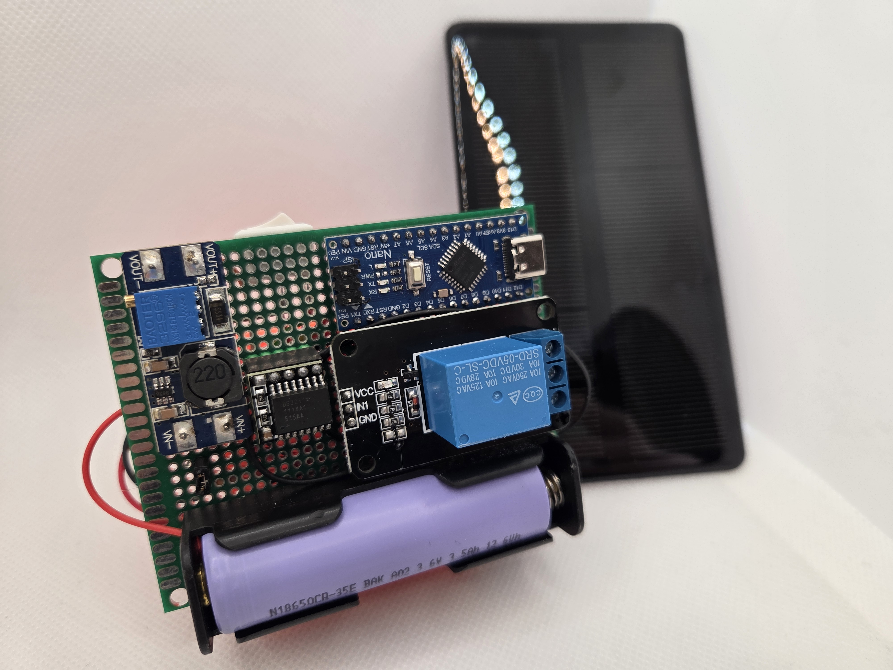
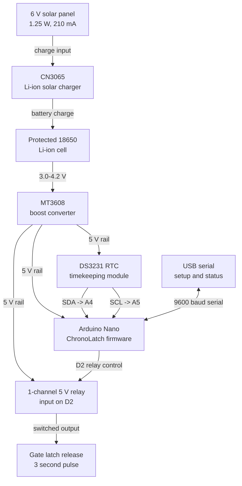
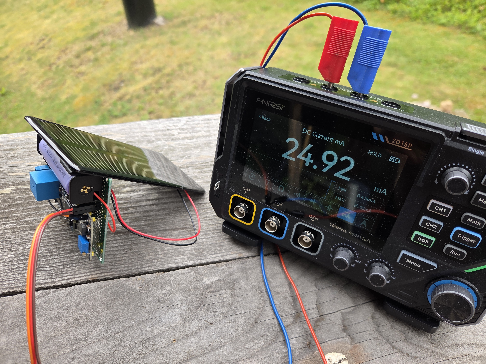

# ChronoLatch

ChronoLatch is a solar-powered, release-only gate latch timer for horse feeding
and other low-power automation.

At feed time, the controller closes a relay for 3 seconds so spring tension,
gravity, an offset hinge, or a low-force open-only actuator can release the
gate. It never power-closes around animals. USB serial reads and sets the RTC
clock and daily opening time.

### Prototype Hardware

Bench prototype modules:

- Arduino Nano or Pro Mini with ChronoLatch firmware.
- DS3231 RTC module.
- CN3065 charger, 6 V solar panel, and protected 18650 Li-ion cell.
- MT3608 boost converter for the 5 V rail.
- 1-channel 5 V relay module for the 3 second latch pulse.

### Bill of Materials (BOM)

| Module / Part | Qty | Purpose | Affiliate Link |
| --- | ---: | --- | --- |
| DS3231 RTC module | 1 | Timekeeping | [AliExpress](https://s.click.aliexpress.com/e/_c43xkIFb) |
| Arduino Nano | 1 | Main controller | [AliExpress](https://s.click.aliexpress.com/e/_c4LZC2yH) |
| MT3608 boost converter | 1 | Voltage step-up regulation | [AliExpress](https://s.click.aliexpress.com/e/_c3mCP8yH) |
| CN3065 solar charger module with 6 V solar panel kit | 1 | Solar charging and power input | [AliExpress](https://s.click.aliexpress.com/e/_c3M47D7P) |
| Protected 18650 Li-ion battery | 1 | Rechargeable power storage | TBD |
| 1-channel 5 V relay module | 1 | Switched output control | [AliExpress](https://s.click.aliexpress.com/e/_c43xkIFb) |

### Module Schematic

| Module | Connection |
| --- | --- |
| Relay input | Arduino `D2` |
| DS3231 SDA | Arduino `A4` |
| DS3231 SCL | Arduino `A5` |
| Power rail | MT3608 `5 V` output to Arduino, RTC, and relay module |
| Gate output | Relay contacts switch the latch release circuit |

### Serial Troubleshooting

If a minimal serial sketch works but ChronoLatch prints nothing, check the boot
log:

- `ChronoLatch booting...` means USB serial is alive.
- `Checking RTC...` with no ready message points at the DS3231/I2C bus. Check
  RTC power, ground, `SDA -> A4`, `SCL -> A5`, and pullups.
- `I2C timeout while checking RTC` means the Arduino Wire timeout recovered from
  a stuck I2C transaction.

The firmware sleeps after setup to save power. Press reset or open the serial
monitor immediately after upload when testing commands.

### Power Budget

Measurements after removing the Arduino Nano power LED and relay board VCC LED:

- Sleep load: about 14 mA.
- MCU awake load: about 40 mA.
- Relay closed for the 3 second latch pulse: about 190 mA.
- Firmware cycle: 8 seconds asleep, then about 2 seconds awake for serial.
- Battery: 3500 mAh protected 18650 Li-ion cell.
- Solar panel: mini 6 V, 210 mA, 1.25 W.

The 8 s sleep / 2 s wake cycle averages roughly 19 mA before the relay pulse:

- Daily use: about 461 mAh, or 1.7 Wh from a nominal 3.7 V cell.
- Battery-only runtime: roughly 180 hours, or 7.5 days, before allowing for
  cold weather, battery age, converter losses, and cutoff voltage.
- One 3 second relay pulse adds about 0.16 mAh per opening.

Cloudy-day measurement while the MCU was sleeping:

With the solar panel connected through the charger, battery-side current was
about 25 mA into the battery, or about 25 mAh per hour of similar cloudy light.
Replacing one full day of controller use would take about 18-19 hours at this
rate; brighter sun improves the margin.
